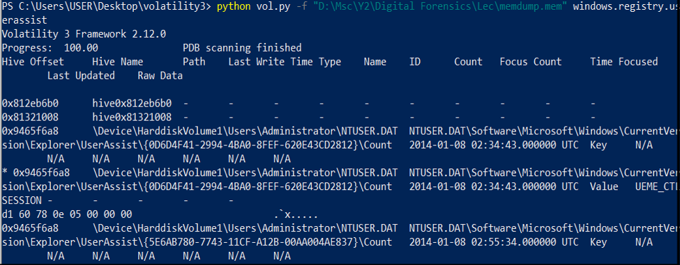

# Memory Forensics: Autopsy vs Volatility (Visual Lab)

This project compares two widely used forensic tools. Autopsy and Volatility for analyzing Windows memory dumps.The analysis demonstrates how each tool performs across key forensic dimensions, such as process extraction, command-line activity, network behavior, and user activity tracking.</br> 
While Autopsy is known for its user-friendly GUI and disk analysis capabilities, Volatility excels in deep memory forensics via command-line plugins.</br>
This comparison helps forensic analysts choose the right tool based on case complexity and required artifact depth.

---

## What This Lab Shows

- How each tool views memory dumps
- Which artifacts are easier to retrieve
- Practical screenshots from both tools
- Brief commentary on usability, depth, and features

---

## Screenshots & Highlights

### Operating System Details

- Autopsy


- Volatility


- Autopsy displays OS metadata using parsed image headers and metadata plugins.
- Volatility extracts more direct memory-level OS details such as kernel versions and profile information.

---

### Running Processes

- Autopsy


- Volatility


- Volatility’s pslist and psscan commands reveal parent-child process relationships, timestamps, and hidden/malicious processes.
- Autopsy provides a simpler, more GUI-friendly process list—good for timeline correlation but less detailed.

### Command Line Execution

- Autopsy


- Volatility


- Volatility plugins extract actual command-line strings executed by users or malware—ideal for behavior-based threat analysis.
- Autopsy shows limited shell interaction unless logged or recovered in filesystem metadata.

### Network Activity

- Autopsy


- Volatility


- Volatility identifies open sockets, listening ports, and remote connections at the time of the memory capture.
- Autopsy may display network-related artifacts (e.g., Wi-Fi configs) only if present in the file system.

### User Activity & Sessions

- Autopsy


- Volatility


- Volatility provides granular visibility into user sessions, login times, and activity trails via plugins like userassist.
- Autopsy shows session metadata and accessed files, offering a higher-level reconstruction of user behavior.

## Tool Summary

| Feature              | Autopsy                         | Volatility                      |
|----------------------|----------------------------------|----------------------------------|
| Interface            | GUI                              | Command-line                    |
| Memory Plugin Depth  | Basic                             | Advanced                     |
| Ideal For            | Beginners, disk forensics        | Malware, RAM analysis           |
| Custom Plugins       | Limited                          | Extensive                    |

---

## Summary

- Volatility is the go-to tool for advanced memory forensics, especially when precision, depth, and custom plugin capabilities are required.

- Autopsy excels in GUI-driven workflows and disk image analysis but lacks depth in RAM-based forensic tasks unless enhanced with external tools like Volatility.

- Ideal Strategy: Use both—Autopsy for high-level case management and disk analysis, Volatility for deep dive memory examination.

---

## Folder Structure

```text
memory-forensics-autopsy-vs-volatility/
├── screenshots/
└── README.md
